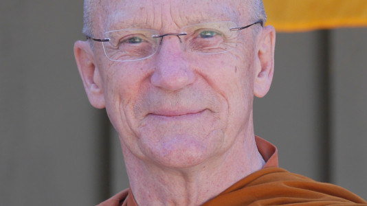

<!--TITLE:The Ajahn Pasanno Question and Story Archive-->
<!--HTML  -->

# Introduction

Ajahn Pasanno excels at answering Dhamma questions. Well over 100 hours of recorded question and answer sessions and discussions led by him are available online. So if you have a Dhamma question, it’s likely that Ajahn Pasanno has spoken to it in the past. But how will you find his answer amidst the hours of recordings?

This archive is an attempt to make the oral teachings of Ajahn Pasanno more accessible. It contains transcriptions/summaries of questions asked and audio recordings of Ajahn Pasanno’s answers. The questions are organized by event and tagged by subject. The stories Ajahn Pasanno tells in the course of answering Dhamma questions are often as valuable as the questions themselves. Thus I expanded the archive to include stories, quotes, readings, sutta references, and other content in addition to questions and answers. Ajahn Pasanno readily shares the teaching seat with other Abhayagiri residents and invited guests, and the archive includes material from those who teach alongside him.

## Website
This website is a series of static pages generated from the archive database. It currently contains over 1,000 excerpts from more than two dozen events. I originally conceived of it as a prototype stepping stone to a modern search-driven website created by someone with more web skills. However, with a css makeover by Chris Claudius and a floating media player created by my nephew Owen, the prototype began to look and work well enough to publish. It would benefit greatly from a text search feature if anyone has the skill and time to contribute one.

## Where to Begin
The Archive contains so much material that it can be difficult to know where to start. Here are my suggestions:

If you have a question about a specific topic, try looking for it in the [alphabetical tag list](../indexes/AlphabeticalTags.html). If you can't find it there, try using your browser's search feature in the [searchable list of all excerpts](../indexes/AllExcerpts-all.html).

If you would like to listen to thematic teachings, look on the [events page](../indexes/EventsBySeries.html). Here are some events I recommend:

- [Recollections of Ajahn Chah](../../pages/events/SRD2010.html)
- [Tudong Stories at Spirit Rock](../../pages/events/SRD2011.html)
- [Right Livelihood](../../pages/events/UD2013-1.html)
- [Death and Dying](../../pages/events/UD2014-1.html)
- [The Thai Forest Tradition](../../pages/events/UD2014-2.html)
- [The Middle Way of Not-self](../../pages/events/UD2015-2.html)
- [Jhāna: A Practical Approach](../../pages/events/UD2015-4.html)

If you are interested in the conceptual framework underlying these teachings, look through the [tag hierarchy page](../drilldown/tag-999.html).

## Dedication
This project is dedicated to Luang Por Pasanno (Tan Chao Khun Phra Rajabodhividesa), my preceptor, teacher, and mentor. He has given his life to continuing Luang Pu Chah’s efforts to establish Westerners in the Saṅgha and the Saṅgha in the West. He founded and/or was a long-term abbot of all the monasteries where I trained before my tenth rains. He sets an impeccable example of the Holy Life well-lived, and I’ve watched him handle many challenging situations with confidence and ease. The epithet of the Saṅgha, “They give occasion for incomparable goodness to arise in the world,” certainly applies to Luang Por.

Organising Luang Por’s questions and stories so others can find them barely begins to repay my debt of gratitude to him.

Ajahn Kaccāna

September 3, 2023

