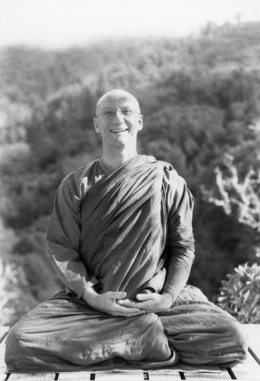

<!--HTML  -->
# Acknowledgements

This project would not have been possible without the assistance of many people. It would have been prohibitively expensive and time-consuming if not built upon not previous open-source software projects.

## People
Chris Claudius created the overall web design. My newphew Owen made the floating media player. His father Michael contributed to early architecture decisions.

Ajahn Ṭhitapañño helped liase with Abhayagiri Monastery and Kirschbaum Development to host the Archive on abhayagiri.org. Ajahn Suhajjo helped with the Pāli tag scheme, teacher chronology, and license details. Debbie Stamp contributed her memories to the history of Abhayagiri Thanksgiving Retreats.

## Projects
The Archive relies upon many common open-source and freeware tools. In addition to the python modules listed in [requirements.txt](https://github.com/Kaccana-Bhikkhu/qs-archive/blob/main/requirements.txt), I would like to specifically acknowledge:

- [mp3DirectCut](https://mpesch3.de/): Fast, lossless audio splitting
- [readingfaithfully.org](https://sutta.readingfaithfully.org/): Easy links to free sutta translations

## Photo Credits

- Series - Winter Retreats: Dave Getzschman
- Want to Help? Somkid
- Acknowledgements: Jonny Breeze

-----

<!--HTML  -->
